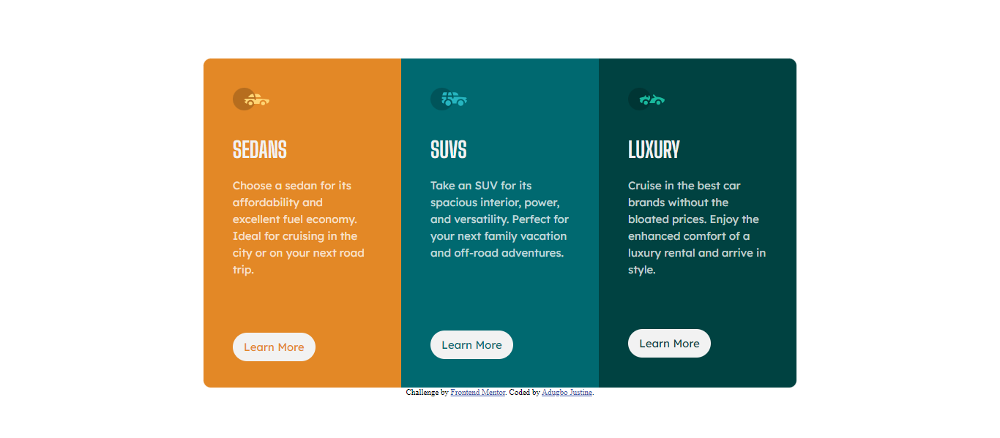

# Frontend Mentor - 3-column preview card component solution

This is a solution to the [3-column preview card component challenge on Frontend Mentor](https://www.frontendmentor.io/challenges/3column-preview-card-component-pH92eAR2-). Frontend Mentor challenges help you improve your coding skills by building realistic projects. 

## Table of contents

- [Overview](#overview)
  - [The challenge](#the-challenge)
  - [Screenshot](#screenshot)
  - [Links](#links)
- [My process](#my-process)
  - [Built with](#built-with)
  - [What I learned](#what-i-learned)
  - [Continued development](#continued-development)
  - [Useful resources](#useful-resources)
- [Author](#author)
- [Acknowledgments](#acknowledgments)

## Overview

### The challenge

Users should be able to:

- See hover states for interactive elements

### Screenshot

### Links

- Solution URL: (https://www.frontendmentor.io/solutions/html-5-css-grid-and-flex-box-YD9Hc6azkF)
- Live Site URL: ( https://justine1285.github.io/3-column-preview-card-component/)

## My process

### Built with

- Semantic HTML5 markup
- CSS custom properties
- Flexbox
- CSS Grid

### What I learned

i learnt more on the use of grid and flex box and how interesting these can be played with while coding.

### Continued development

still planning on improving on my css skills and hoping i get better with more practice.

## Author

- Frontend Mentor - [@justine1285](https://www.frontendmentor.io/profile/justine1285)
- Twitter - [@justine_mamus](https://www.twitter.com/justine_mamus)

## Acknowledgments

i want to first of all thank myself because it hasnt been easy going through this journey and i also want to thank @davegray as well as @simpledev for their work on tutorials.